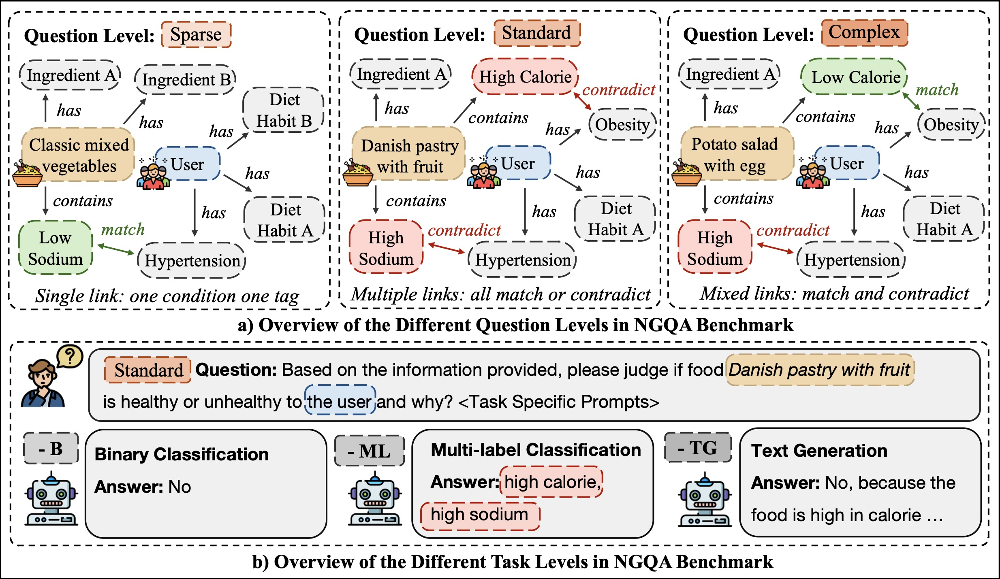

# NGQA: A Nutritional Graph Question Answering Benchmark for Personalized Health-aware Nutritional Reasoning

## Overview



## Usage

Install the required packages by running: 

```bash
pip install requirements.txt
```

To construct the benchmark from scratch, please follow the instructions below. There is also a ready-to-go benchmark file in `processed_data/` folder named `NGQA_benchmark.csv`.

1. Download the raw data from [here](https://drive.google.com/drive/folders/1bR_ZGGxet19GC7rbqB5y7oor4WsaGylJ) and put the entire `data/` folder under the main folder.

2. Run through the notebooks under `./benchmark_pipeline`.

To run the experiments, please follow the instructions below:

0. Have the benchmark file ready. 

1. Add your own OpenAI API key to the environment variables with the name "API_KEY".

2. Run `main.py` or `playground.ipynb` under `./experiments`.
